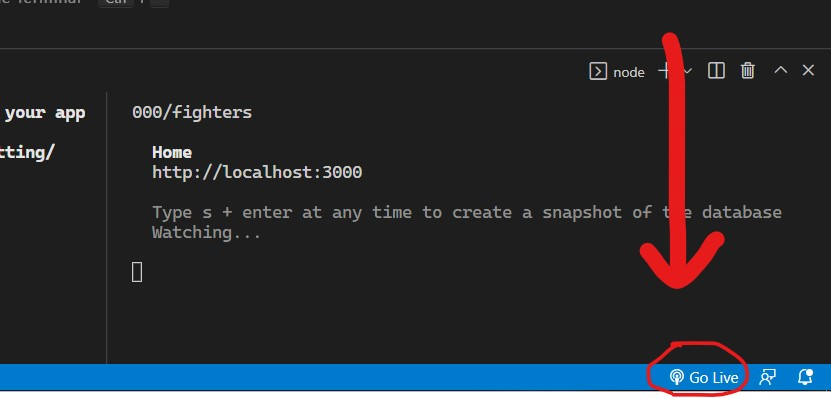

# Pick the Right Fight

## _Aplikacija_

**Naziv:** Pick the Right Fight

**Tehnologija:** RxJS

**Namena:** Prvi projekat iz predmeta Razvoj Web Aplikacija

**Opis:** Web aplikacija namenjena ljubiteljima borilackih vestina. Predvidjajte ishode matchup-ova koji su vama zanimljivi u razlicitim borilackim sportovima i pobedite protivnika tako sto cete pogodite sto vise parova. Srecno!

## _Instalacija_
1. Pozicionirajte se u vasem CMD-u u zeljeni direktorijum
2. Klonirajte repozitorijum naredbom 
```sh
git clone https://github.com/MarkoMilosavljevic00/RWA_Projekat_rxjs.git
``` 
3. Pokrenite Visual Studio Code u folderu repozitorijuma i otvorite terminal
4. Instalirajte webpack naredbom u terminalu 
```sh
npm install webpack webpack-cli --save-dev
```
> U terminalu moramo biti pozicionirani na direktorijum gde smo klonirali repo

## _Pokretanje_
1. Otvorite dva terminala
2. U jednom terminalu kucate sledeci kod za bundlovanje fajlova u watch modu
```sh
npm run watch
```
3. U drugom terminalu kucate sledeci kod za pokretanje **Json-Server**-a
```sh
npm run api
```
4. U donjem desnom uglu pritiskamo **Go Live** kako bismo pokrenuli **Live-Server** (*slika1*)


> Potrebne ekstenzije za pokretanje:
> Live-Server
> Json-Server
