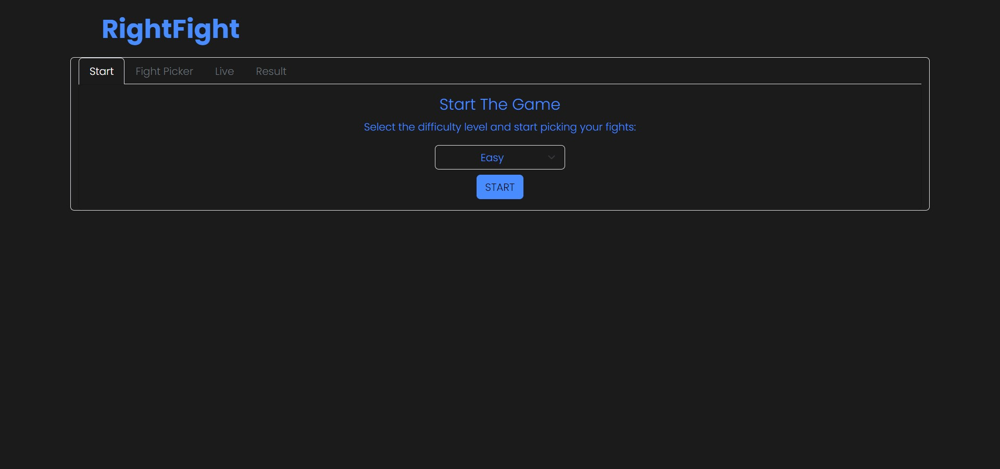

# Pick the Right Fight

## _Application_

**Name:** Pick the Right Fight

**Technology:** RxJS

**Purpose:** The first project from the course Web Application Development

**Description:** A web application for martial arts enthusiasts. Predict the outcomes of matchups that interest you in different combat sports and beat your opponent by guessing as many pairs as possible.


## _Walkthrough_ 

### _Start_ 
The appearance of the initial screen when the application is launched:
 

The user selects the difficulty level at which they want to play against the CPU (_Medium, Easy or Hard_).

 
 
 By pressing the 'START' button, a random opponent with the selected difficulty level is assigned to us, and the 'Fight Picker' tab is activated.
 
### _Fight Picker_ 
The Fight Picker tab first appears on the screen.
 

#### _Main scoreboard_
First, let's take a look and explain the main scoreboard.
 
 
In the central part, we see the **Opponent** card, which provides us with a view of the currently selected opponent. We can see the opponent's **name**, his **difficulty level**, and his **picture**.

On the left and right, we see the **User's (Your) points** and the **Opponent's points**, displaying the current score between the user and the opponent. We will explain the point allocation system a bit later

#### _Picker and fight list_
First, in the Fight Picker, we select the desired **Rules** and **Weightclass** to get the appropriate fighters. Afterward, we can choose fighters from that weight class whose outcome we want to predict. Next, we select the desired options for our _Pick_. We choose the fighter we think will win (**Winner**), then the **Method**, and **Round**. 
 
 
 Once we have composed our _Pick_, we select the **Add Fight** option to add it to our **Fight Card**.
 *Fight Card example:*
  
  

## _Installation_
1. Position yourself in your CMD in the desired directory
2. Clone the repository with the command 
```sh
npm install webpack webpack-cli --save-dev
```

> In the terminal we must be positioned on the directory where we cloned the repo


## _Running_

1.  Open two terminals
2.  In one terminal type the following code for bundling files in watch mode

```sh
npm run watch

```

3.  In the other terminal type the following code to run  **Json-Server**

```sh
npm run api
```

4.  In the lower right corner press  **Go Live**  to run  **Live-Server** (*image1*)
 

> Required extensions for running: **Live-Server** 

  
  

>  - Live-Server

  

>  - Json-Server
