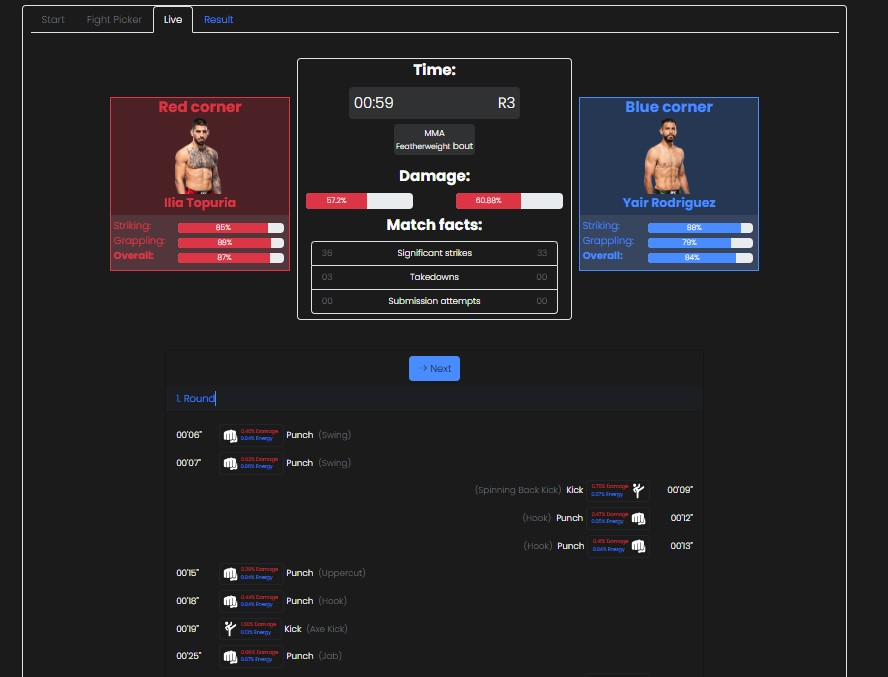

# Right Fight

## _Application_

**<u>Name:</u>** Right Fight

**<u>Technology:</u>** RxJS

**<u>Purpose:</u>** The first project from the course Web Application Development

**<u>Description:</u>** A web application for martial arts enthusiasts. Predict the outcomes of matchups that interest you in different combat sports and beat your opponent by guessing as many pairs as possible.
## _Walkthrough_ 
### _<u>Start</u>_ 
The appearance of the initial screen when the application is launched:

 

The user selects the difficulty level at which they want to play against the CPU (_Medium, Easy or Hard_).

 
 
 By pressing the **'START'** button, a random opponent with the selected difficulty level is assigned to us, and the 'Fight Picker' tab is activated.
 
### _<u>Fight Picker</u>_ 
The Fight Picker tab first appears on the screen:

 

#### <u>_Main scoreboard</u>_

First, let's take a look and explain the main scoreboard.

 
 
In the central part, we see the **Opponent** card, which provides us with a view of the currently selected opponent. We can see the opponent's **name**, his **difficulty level**, and his **picture**.

On the left and right, we see the **User's (Your) points** and the **Opponent's points**, displaying the current score between the user and the opponent. We will explain the point allocation system a bit later

#### _<u>Picker and fight list</u>_

 

First, in the Fight Picker, we select the desired **Rules** and **Weightclass** to get the appropriate fighters. Afterward, we can choose fighters from that weight class whose outcome we want to predict.

When we select a specific fighter, below their image, we can see a bar with their skills. Depending on the sport they compete in, a fighter can possess **Striking** skills (stand-up fighting) and **Grappling** skills (wrestling and BJJ abilities of the fighter), or both. The **Overall rating** represents the average value of these two skills.
Skills represent a fighter's affinities, based on which their attacks are determined later (such as **Punch**, **Takedown**, **Kick**, or **Submission Attempt**), **power** and success of that attack, as well as the amount of **energy** required to execute that move.

Next, we select the desired options for our _Pick_. We choose the fighter we think will win (**Winner**), then the **Method**, and **Round**. 
 
 Once we have composed our _Pick_, we select the **'ADD FIGHT'** option to add it to our **Fight Card**.
 *Fight Card example:*
 
  
  
  > Also, using the **'UNDO'** button, we can undo the last added *Fight* and *Pick* if we want to make changes or simply delete a fight.
  > 
  >   
 
 Once we have created the desired **Fight Card** with Picks, we initiate the fights by clicking the **'START FIGHTS'** button.

### _<u>Live</u>_
The appearance of the Live tab when the fights are initiated.

 

This component operates similarly to 'flash-score' applications that are widespread and widely used on the web.

The first thing we see on the page is a scoreboard that contains cards with fighters (and their skills) who are currently in the fight. We also see a central scoreboard that includes a **Timer** counting down the **Time** and **Rounds**, bars showing the damage inflicted on both fighters, as well as fight statistics (the number of _Significant Strikes_, _Takedowns_, _Submission Attempts_ for both fighters). This component updates during the fight at each event that occurs and provides us with insight into the current course of the fight.


Below that, we see a list of events that informs us in real-time when an event has occurred (_round_ and _time_), as well as information about the event itself, such as: what type of event it is (Punch, Kick, Takedown, etc.), how much damage the event causes, and how much energy is required to execute it.

At the end of each round, the winner of that round is determined based on which fighter inflicted more damage on their opponent during that round. The scoring system is as follows:

-   _10 points - **Winner** of the round_
-   _9 points - **Loser** of the round_
-   _8 points - **Loser** of the round if the opponent has inflicted significantly more damage_ If the fight goes to a **Decision** (i.e., there is no stoppage due to KO/TKO or Submission), the points from the scored rounds are added up, and the **Winner of the match is the fighter with more total points.**


If there is a **KO/TKO** or **Submission** finish (one of the fighters reaches 100% damage), the winner is declared immediately, and we move on to the next fight. Transition to the next fight is executed by pressing the **'NEXT'** button.


### _<u>Results</u>_
Throughout the fight happening in the **Live** tab, we can also keep track of the final results in the **Result** tab.


As the fights conclude, their final outcomes are displayed in the **Result list** along with our and the opponent's predictions. For each match, on the left side, we see our Picks in the **Your pick** section, and on the right side, we see the opponent's Picks in the **Opponent's pick** section. This component also calculates our and the opponent's points earned for each fight. The scoring system is as follows:

-   10 points for correctly predicting the **Winner of the fight**
-   5 points for correctly predicting the **Method along with the previously correctly predicted winner**
-   5 points for correctly predicting the **Round along with the previously correctly predicted winner**


In the end, all points are added up, and the system informs us whether we have won or lost the duel against the opponent.


 If we wish, we can play a new game with a new Fight Card without resetting the scores by pressing the **PLAY AGAIN** button.
 


## _Installation_
1. Position yourself in your CMD in the desired directory
2. Clone the repository with the command 
```sh
npm install webpack webpack-cli --save-dev
```

> In the terminal we must be positioned on the directory where we cloned the repo


## _Running_

1.  Open two terminals
2.  In one terminal type the following code for bundling files in watch mode

```sh
npm run watch

```

3.  In the other terminal type the following code to run  **Json-Server**

```sh
npm run api
```

4.  In the lower right corner press  **Go Live**  to run  **Live-Server** (*image1*)

 

> Required extensions for running: 

  
  

>  - Live-Server

  

>  - Json-Server

## _Configuration_
If we want to manipulate some constants, such as the typing speed, duration, and number of rounds, and similar settings, we can do so in the file **"src > utilities > constants.ts."**

In the **RULES** constant, we can find and change some of the constants related to a specific sport (MMA, Boxing, Kickboxing, or Grappling):

-   **Number of rounds in a fight:** NUMBER_OF_ROUNDS
-   **Duration of one round:** ROUND_DURATION_IN_MINUTES
-   **Number of generated events per fight (recommended range is from 80 to 200):** EVENTS_PER_FIGHT

In the **TIME** constant, we can change some time-related settings, timer ticking, and more:

-   **How many milliseconds in the real world correspond to one second in the fight:** TICK_DURATION

In the **POINTS** constant, we can modify scoring-related settings for fights (how many points the winner of the fight takes, how many the loser takes, and how many the convincingly defeated takes), as well as scoring for the game between the user and the CPU (how many points for predicting the winner, method, and round).

In the **PROBABILITY** constant, we find settings related to the probability of different types of strikes occurring, the likelihood of POWER strikes, and more.

In the **DAMAGE** constant, we can adjust the damage range for different types of strikes, whether it's a POWER strike, and the threshold for considering a victory to be convincing.
